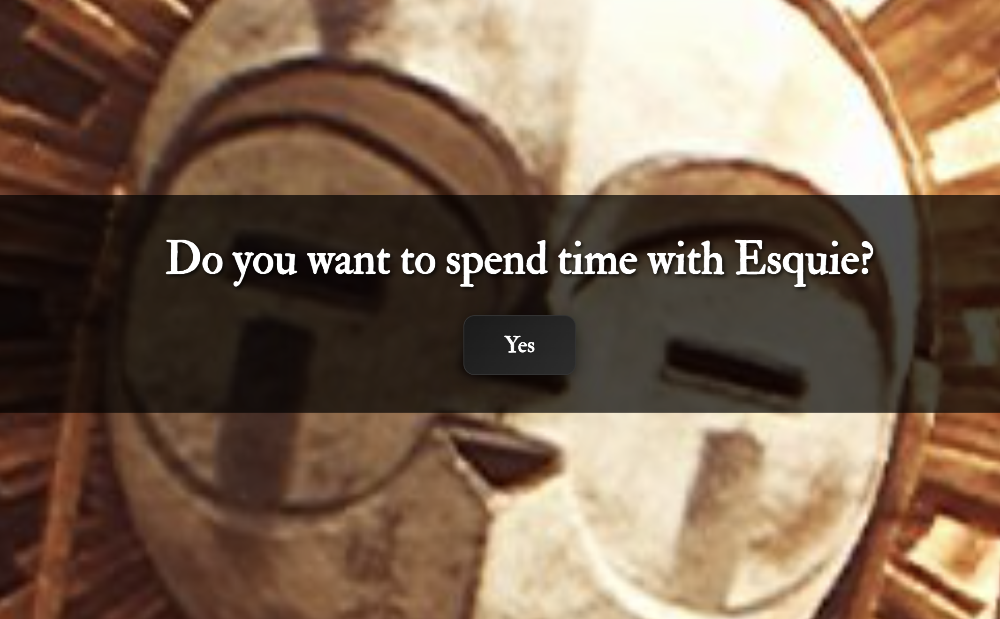

# Esquie.org



A whimsical web application paying homage to Esquie, the beloved character from Clair Obscur: Expedition 33. Experience Esquie's wholesome wisdom through random quote and image combinations in an immersive full-screen interface.

## 🦉 About Esquie

Esquie is known for his unique emotional system ("Wheee" for happy, "Whooo" for sad), childlike wonder combined with unexpected wisdom, and charming simplicity. This application captures his positive spirit through carefully curated quotes and beautiful character images.

## ✨ Features

- **Immersive Experience**: Full-screen character images with elegant text overlays
- **Random Combinations**: 7 quotes × 6 images = endless delightful discoveries
- **Responsive Design**: Optimized for mobile, tablet, and desktop
- **Accessibility**: Keyboard navigation and screen reader support
- **Performance**: Fast loading with Cloudflare Workers backend
- **Character Faithful**: Maintains Esquie's positive nature (only "Yes" button, no negativity)

## 🚀 Quick Start

### Prerequisites
- Node.js (v18 or later)
- npm or yarn
- Cloudflare account (for deployment)

### Local Development

1. **Clone the repository**
   ```bash
   git clone <repository-url>
   cd esquie
   ```

2. **Install dependencies**
   ```bash
   npm install
   ```

3. **Start development server**
   ```bash
   npm run start
   # or
   npx wrangler dev --local
   ```

4. **Open in browser**
   ```
   http://localhost:8787
   ```

### Available Scripts

- `npm run dev` - Start development server
- `npm run start` - Start local development server
- `npm run build` - Build for production
- `npm run deploy` - Deploy to Cloudflare Workers
- `npm test` - Run test suite
- `npm run test:watch` - Run tests in watch mode

## 🏗️ Project Structure

```
esquie/
├── src/
│   ├── index.js              # Main Cloudflare Worker script
│   └── assets/               # Static assets
│       ├── styles.css        # Application styling
│       ├── script.js         # Client-side JavaScript
│       ├── image-config.json # Per-image positioning config
│       ├── quotes.json       # Esquie quotes collection
│       └── images/           # Character images
│           ├── esquie1.jpg
│           ├── esquie2.jpg
│           ├── esquie3.jpg
│           ├── esquie4.jpg
│           ├── esquie5.jpg
│           └── esquie6.jpg
├── tests/                    # Test suite
├── docs/                     # Documentation
├── wrangler.toml            # Cloudflare Workers config
└── package.json             # Project dependencies
```

## 🎨 Customization

### Image Positioning

Edit `src/assets/image-config.json` to adjust how each image is displayed:

```json
{
  "esquie1.jpg": {
    "objectFit": "cover",
    "objectPosition": "center 15%"
  }
}
```

- `objectFit`: `"cover"` (fills screen) or `"contain"` (shows full image)
- `objectPosition`: `"center center"`, `"center 15%"`, `"center top"`, etc.

### Adding Quotes

Add new quotes to the `QUOTES` array in `src/index.js` following Esquie's character voice.

## 🧪 Testing

⚠️ **TODO: Fix unit tests in CI environment** - Currently unit tests fail in GitHub Actions but work locally. Investigation needed for CI-specific issues.

Run the test suite to ensure everything works correctly:

```bash
# Run all tests (via Makefile)
make test

# Run specific test types
make test-unit        # Unit tests (currently have CI issues)
make test-manual      # Manual tests (requires server running)
make test-integration # Integration tests (requires server running)

# Or use npm directly
npm test              # Unit tests only
npm test debug-css    # Test file reading and structure
npm test manual-css   # Test server endpoints (requires server)
```

## 🚀 Deployment

Deploy to Cloudflare Workers:

```bash
# Build and deploy
npm run deploy

# Or use wrangler directly
npx wrangler deploy
```

## 🎭 Character Design

The application follows Esquie's character traits:
- **Wholesome & Positive**: No negative options, only "Yes" responses
- **Simple yet Wise**: Clean interface with profound quotes
- **Childlike Wonder**: Playful animations and whimsical design
- **Charming Simplicity**: Minimal complexity, maximum warmth

## 📜 Quotes

The application features carefully curated quotes that capture Esquie's essence:
- "Stars are the apples of the sky."
- "Want a hug?"
- "Mon ami!"
- And more...

## 🤝 Contributing

This project celebrates Esquie's character. When contributing:
- Maintain the wholesome, positive tone
- Follow existing code conventions
- Test thoroughly before submitting
- Keep Esquie's character traits in mind

## 📄 License

MIT License - feel free to spread Esquie's wisdom!

---

*"Losing a rock is better than never having a rock!"* - Esquie